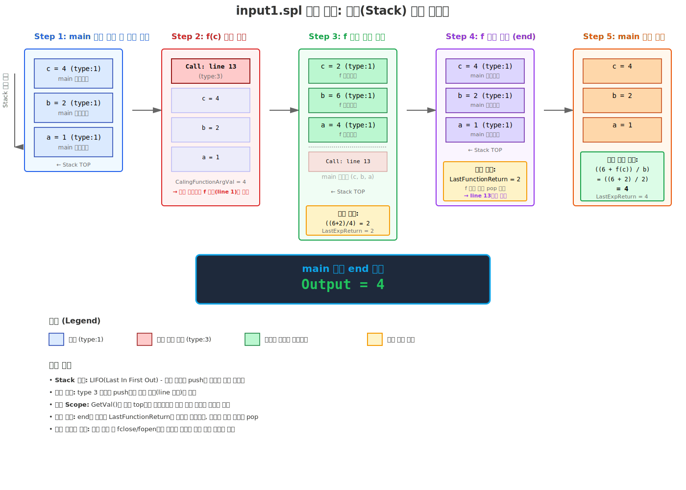

# 운영체제 과제 보고서

## 과제명: Basic Interpreter 소스 코드 분석

**과목명**: 운영체제  
**수강반**: 002반  
**이름**: 박효준  
**학번**: 20210843  
**제출일**: 2025년 11월 14일

---

## 목차

1. [과제 개요](#1-과제-개요)
2. [분석 환경 및 실행 방법](#2-분석-환경-및-실행-방법)
   - 2.1. 개발 및 실행 환경
   - 2.2. 빌드 및 실행 절차
3. [코드 구조 분석](#3-코드-구조-분석)
   - 3.1. 주요 자료구조
   - 3.2. 핵심 함수 기능
4. [입력 파일(input1.spl) 실행 흐름 분석](#4-입력-파일input1spl-실행-흐름-분석)
   - 4.1. main 함수 진입 및 변수 선언
   - 4.2. f(c) 함수 호출 및 인자 전달
   - 4.3. f 함수 내부 연산 과정
   - 4.4. main 함수 복귀 및 최종 연산
   - 4.5. 스택(Stack) 변화 과정 시각화
5. [코드 상세 분석 (Line-by-Line)](#5-코드-상세-분석-line-by-line)
   - 5.1. 헤더 파일 및 전처리기
   - 5.2. 자료구조 정의
   - 5.3. 함수 전방 선언
   - 5.4. 스택 연산 함수들
   - 5.5. 유틸리티 함수들
   - 5.6. main 함수
   - 5.7. begin/end 처리
   - 5.8. 변수 선언 처리
   - 5.9. 함수 정의 처리
   - 5.10. 수식 처리 - 중위→후위 변환
   - 5.11. 수식 처리 - 후위 표기법 계산
   - 5.12. 프로그램 종료 처리
   - 5.13. 보조 함수들
   - 5.14. 전체 실행 흐름 요약
   - 5.15. 주요 함수 호출 흐름도
   - 5.16. 핵심 기능 정리
6. [결론](#6-결론)

---

## 1. 과제 개요

본 보고서는 C언어로 작성된 'Very Basic Interpreter'의 소스 코드를 분석하는 것을 목표로 합니다. 과제 요구사항에 따라, 소스 코드 전체를 라인 단위로 분석하고, 입력 파일(input1.spl)이 처리되어 최종 결과를 출력하기까지의 모든 과정을 코드 레벨에서 추적합니다. 

이를 통해 다음을 학습합니다:
- 시스템 프로그래밍의 기본적인 동작 원리
- 스택 자료구조를 활용한 변수 관리 및 함수 호출
- 중위 표기법에서 후위 표기법으로의 변환 및 계산
- 파일 I/O를 통한 소스 코드 파싱 기법

---

## 2. 분석 환경 및 실행 방법

### 2.1. 개발 및 실행 환경

- **운영체제**: Windows 11
- **컴파일러**: MinGW (GCC 13.2.0)
- **소스 코드**: basic_interpreter.c (503 lines)
- **입력 파일**: input1.spl, input2.spl, input3.spl, input4.spl

### 2.2. 빌드 및 실행 절차

제공된 **운영체제 인터프리터 실행 매뉴얼(MinGW).pdf** 파일에 따라 다음 절차를 수행하여 프로그램을 실행했습니다.

#### 1단계: MinGW 설치 및 환경 변수 설정

1. **winlibs.com**에서 MinGW-w64 다운로드
2. 압축 해제 후 `C:\mingw64` 경로에 배치
3. 시스템 환경 변수 Path에 `C:\mingw64\bin` 추가
4. 명령 프롬프트에서 `gcc --version` 실행하여 설치 확인

#### 2단계: 소스 코드 컴파일

```bash
cd [소스코드_폴더경로]
gcc basic_interpreter.c -o basic_interpreter
```

컴파일이 성공하면 `basic_interpreter.exe` 파일이 생성됩니다.

#### 3단계: 프로그램 실행

```bash
basic_interpreter input1.spl
```

#### 4단계: 결과 확인

실행 결과로 **Output=4**가 출력되는 것을 확인했으며, 이는 `outputs.txt` 파일에 명시된 input1.spl의 예상 결과와 일치합니다.

---

## 3. 코드 구조 분석

`basic_interpreter.c` 코드는 **스택(Stack) 자료구조**를 중심으로 변수와 함수 호출을 관리하며, **중위 표기법**(Infix)으로 작성된 수식을 **후위 표기법**(Postfix)으로 변환하여 계산하는 방식으로 동작합니다.

### 3.1. 주요 자료구조

#### Node / Stack (Lines 16-26)
프로그램의 변수, 함수 정의, 함수 호출 정보 등을 저장하는 **핵심 자료구조**입니다.

```c
struct node {
    int type;         // 1:변수, 2:함수정의, 3:함수호출, 4:begin, 5:end
    char exp_data;    // 식별자 (변수명/함수명의 첫 글자)
    int val;          // 변수의 값 또는 연산 결과
    int line;         // 함수 정의/호출 위치 (라인 번호)
    struct node* next; // 다음 노드 포인터 (연결 리스트)
};
```

**type 필드의 의미:**
- `1`: 변수 (예: `int a = 5`)
- `2`: 함수 정의 (예: `function f(int x)`)
- `3`: 함수 호출 마커 (복귀 주소 저장)
- `4`: begin 블록 시작
- `5`: end 블록 종료

#### opNode / OpStack (Lines 28-32)
수식을 후위 표기법으로 변환할 때 **연산자**(+, -, *, /)를 임시로 저장하기 위한 스택입니다.

#### Postfixnode / PostfixStack (Lines 34-38)
후위 표기법으로 변환된 수식을 계산할 때 **피연산자**(숫자)를 저장하기 위한 스택입니다.

### 3.2. 핵심 함수 기능

| 함수명 | 기능 | 반환값 |
|--------|------|--------|
| `main()` | 프로그램 주 진입점, 파일 읽기 및 파싱 | int |
| `Push()` | Stack에 Node 추가 | Stack* |
| `Pop()` | Stack에서 Node 제거 | void |
| `GetVal()` | 변수/함수 값 조회 | int |
| `GetLastFunctionCall()` | 최근 함수 호출 위치 검색 | int |
| `PushOp()` / `PopOp()` | 연산자 스택 조작 | OpStack* / char |
| `PushPostfix()` / `PopPostfix()` | 후위식 계산 스택 조작 | PostfixStack* / int |
| `Priotry()` | 연산자 우선순위 반환 | int |
| `my_stricmp()` | 대소문자 무시 문자열 비교 | int |
| `rstrip()` | 문자열 끝 공백 제거 | void |
| `FreeAll()` | 스택 메모리 해제 | Stack* |

---

## 4. 입력 파일(input1.spl) 실행 흐름 분석

### input1.spl 내용

```c
function f(int a)
begin
   int b = 6;
   int c = 2;
   ((b+c)/a);
end

function main()
begin
   int a = 1;
   int b = 2;
   int c = 4;
   ((6 + f(c) ) / b);
end
```

### 4.1. main 함수 진입 및 변수 선언

1. 파일을 한 줄씩 읽으며 `function main()`을 발견하면 `foundMain` 플래그를 1로 설정
2. 본격적인 코드 해석 시작
3. main 함수 내의 변수 **a=1, b=2, c=4**가 차례대로 STACK에 저장(push)됨

**스택 상태:**
```
TOP → [c=4] → [b=2] → [a=1] → [main 함수 정의]
```

### 4.2. f(c) 함수 호출 및 인자 전달

1. `((6 + f(c) ) / b);` 라인을 만나면, 인터프리터는 **f(c)를 함수 호출로 인식**
2. `GetVal()` 함수를 통해 인자 `c`의 값인 **4**를 가져와 전역 변수 `CalingFunctionArgVal`에 저장
3. 현재 라인 번호(13)와 함께 **함수 호출 정보**(type 3)를 STACK에 저장
4. 파일 포인터를 input1.spl의 **맨 처음으로 되돌린** 후, `GetVal()`을 통해 찾은 **f 함수의 정의 위치**(1번 라인)로 이동

**스택 상태:**
```
TOP → [Call marker: line 13] → [c=4] → [b=2] → [a=1] → ...
```

### 4.3. f 함수 내부 연산 과정

1. f 함수가 시작되면, main에서 전달된 인자 값 **4**가 f 함수의 매개변수 **a**에 할당되어 STACK에 저장됨
2. f 함수 내의 지역 변수 **b=6, c=2**가 STACK에 저장됨
3. `((b+c)/a)` 수식을 계산:
   - STACK의 가장 위에는 f 함수의 변수들이 있으므로, 이 값들을 사용
   - 중위→후위 변환: `bc+a/`
   - 후위식 계산: `6 2 + 4 /` → `8 4 /` → **2**
4. 연산 결과 **2**는 `LastExpReturn` 변수에 저장됨
5. `end`를 만나 함수가 종료되면, `LastExpReturn`의 값 **2**가 `LastFunctionReturn` 변수로 옮겨짐

**스택 상태 (f 함수 실행 중):**
```
TOP → [c=2] → [b=6] → [a=4] → [f 함수 정의] → [Call: line 13] → [main의 c=4] → ...
```

### 4.4. main 함수 복귀 및 최종 연산

1. `GetLastFunctionCall()`을 통해 main 함수에서 f를 호출했던 **라인 번호**(13)를 찾아 파일 포인터를 다시 그 위치로 이동
2. STACK에서 f 함수 호출과 관련된 정보들을 제거(pop):
   - f의 지역 변수 c=2, b=6, a=4
   - 함수 호출 마커(type 3)
   - f 함수 정의 노드
3. `((6 + f(c) ) / b);` 수식 계산을 재개:
   - f(c) 부분은 `LastFunctionReturn`에 저장된 **2**로 대체
   - 수식은 `((6 + 2) / b)`가 됨
   - `GetVal()`을 통해 main 함수의 변수 b의 값인 **2**를 가져옴
4. 최종 연산 `(8 / 2)`를 수행하여 결과 **4**를 얻고, 이 값을 `LastExpReturn`에 저장
5. main 함수의 `end`를 만나면, `LastExpReturn`에 저장된 최종 값 **4**를 `"Output=4"` 형식으로 출력

**스택 상태 (복귀 후):**
```
TOP → [c=4] → [b=2] → [a=1] → [main 함수 정의]
```

### 4.5. 스택(Stack) 변화 과정 시각화



다이어그램은 다음 5단계를 시각적으로 보여줍니다:
1. **Step 1**: main 함수 진입 및 변수 선언 (a=1, b=2, c=4)
2. **Step 2**: f(c) 함수 호출 (type 3 마커 push, CalingFunctionArgVal=4 저장)
3. **Step 3**: f 함수 내부 실행 (매개변수 a=4, 지역변수 b=6, c=2 push 및 수식 계산)
4. **Step 4**: f 함수 종료 (LastFunctionReturn=2 저장, f의 변수들 pop, line 13으로 복귀)
5. **Step 5**: main 최종 계산 (((6+2)/2) = 4, Output=4 출력)

---

## 5. 코드 상세 분석 (Line-by-Line)

[별도 마크다운 문서 참조: "5. 코드 상세 분석 (Line-by-Line)"](line-by-line-analysis.md)

본 섹션에서는 basic_interpreter.c의 전체 503줄을 다음과 같이 상세 분석합니다:

- **5.1절**: 헤더 파일 및 전처리기 (Lines 1-14)
- **5.2절**: 자료구조 정의 (Lines 16-38)
- **5.3절**: 함수 전방 선언 (Lines 40-44)
- **5.4절**: 스택 연산 함수들 (Lines 46-120)
- **5.5절**: 유틸리티 함수들 (Lines 122-132)
- **5.6절**: main 함수 (Lines 134-446)
- **5.7절**: begin/end 처리 (Lines 204-247)
- **5.8절**: 변수 선언 처리 (Lines 253-275)
- **5.9절**: 함수 정의 처리 (Lines 276-304)
- **5.10절**: 수식 처리 - 중위→후위 변환 (Lines 305-394)
- **5.11절**: 수식 처리 - 후위 표기법 계산 (Lines 396-434)
- **5.12절**: 프로그램 종료 처리 (Lines 440-446)
- **5.13절**: 보조 함수들 (Lines 448-503)
- **5.14절**: 전체 실행 흐름 요약
- **5.15절**: 코드의 장단점 분석
- **5.16절**: 주요 함수 호출 흐름도
- **5.17절**: 핵심 개념 정리
- **5.18절**: 디버깅 시 유용한 추가 기능 제안
- **5.19절**: 코드 분석 결론

각 라인 또는 코드 블록에 대해 다음 정보를 포함합니다:
- 코드의 역할 및 기능
- 사용된 알고리즘 설명
- 입력/출력 데이터 흐름
- 주의사항 및 제한사항

---

## 6. 결론

본 과제를 통해 스택 기반의 인터프리터가 언어를 해석하고 실행하는 원리를 심도있게 학습할 수 있었습니다.
특히 파일 포인터를 직접 제어하여 함수 호출을 구현하는 방식은 시스템의 동작을 낮은 수준에서 이해하는 데 큰 도움이 되었습니다.
코드 분석 과정에서 효율적이고 안정적인 프로그램을 설계하기 위해 어떤 요소(자료구조, 오류 처리 등)가 중요한지 배울 수 있었습니다.

---

**OS002, 20210843, 박효준**